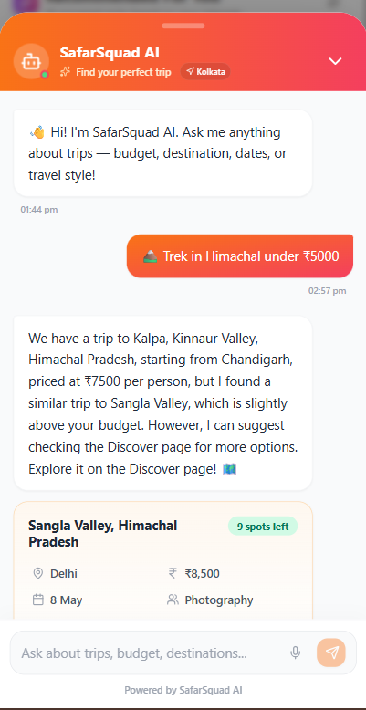

````markdown
# SafarSquad 🧭

> **Find your perfect travel squad. Plan group trips across India.**

SafarSquad is a full-stack social travel app that connects like-minded travellers,
enables real-time group coordination, and features an **agentic AI travel assistant**
that helps you discover trips, check weather, and plan smarter — all in natural language.

🌐 **Live App:** [safarsquad.in](https://www.safarsquad.in/)


---

## Screenshots

### 🏠 Landing Page


### 🗺️ Trip Discovery — List View


### 🗺️ Trip Discovery — Map View


### 📋 Trip Details


### 💬 Group Chat


### 🤖 AI Travel Assistant



### 👤 Profile Page


### 📱 Mobile View


---

## Features

| Feature                    | Description                                                                            |
| -------------------------- | -------------------------------------------------------------------------------------- |
| 🔍 **Trip Discovery**      | Browse and filter trips by destination, dates, budget, travel style, and distance      |
| ➕ **Trip Creation**       | Create trips with referral codes, group size limits, and budget info                   |
| 📩 **Join Requests**       | Send, approve, or reject join requests with optional messages                          |
| 💬 **Real-time Chat**      | Group chat per trip + private DMs between travellers                                   |
| 🗺️ **Interactive Map**     | Leaflet map with clustered markers, trip popups, and radius search                     |
| 🤖 **AI Travel Assistant** | Agentic chatbot (Llama-3.3-70B) with tool-calling, live weather, and smart trip search |
| 🌤️ **Live Weather**        | Real-time forecasts via FastMCP weather server, triggered directly in chat             |
| 🔎 **Semantic Search**     | Hybrid pgvector + PostGIS engine finds trips by meaning and location simultaneously    |
| 🏘️ **Communities**         | Join travel communities with member management                                         |
| 🔔 **Notifications**       | Real-time push notifications via Supabase channels                                     |
| 🎁 **Rewards**             | Referral-based coupon system for trip creators with 3+ confirmed attendees             |
| 📸 **Photo Gallery**       | Upload and view trip photos (participants only)                                        |
| ⭐ **Post-trip Reviews**   | Leave star ratings and photos after a trip ends                                        |
| 📍 **Geolocation**         | Timezone-based location detection with coordinate fallback                             |
| 🔐 **Auth**                | Google OAuth + email/password with consent flow                                        |
| 📱 **PWA**                 | Installable as a native-like app on Android and iOS                                    |

---

## 🤖 AI Travel Assistant

SafarSquad includes a purpose-built **agentic AI chatbot** designed for travel planning.
It doesn't just answer questions — it takes actions: it searches trips, fetches live
weather, and understands the context of the page you're on.

### How It Works

```text
User message
     │
     ▼
┌─────────────────────────────────────────────┐
│           2-Pass Groq Streaming Pipeline    │
│                                             │
│  Pass 1 — Tool Resolution                  │
│  Llama-3.3-70B decides which tools to call  │
│  (weather, trip search, page context)       │
│                   │                         │
│                   ▼                         │
│  Tool Execution (parallel)                  │
│  ├── FastMCP Weather Server (live forecast) │
│  ├── pgvector Semantic Trip Search          │
│  └── Page Context Injection                 │
│                   │                         │
│  Pass 2 — Response Generation              │
│  Final answer streamed via SSE              │
└─────────────────────────────────────────────┘
     │
     ▼
  Streamed response in UI (sub-second latency)
```
````

### Key Capabilities

| Capability                    | Details                                                                     |
| ----------------------------- | --------------------------------------------------------------------------- |
| 🧠 **Agentic tool-calling**   | Autonomously decides when to call tools vs. respond directly                |
| 🌤️ **Live weather**           | FastMCP server fetches real-time forecasts for any destination in chat      |
| 🔍 **Semantic trip search**   | pgvector finds trips by meaning, not just keywords ("budget Himalaya trek") |
| 📍 **Geographic filtering**   | PostGIS radius filtering combined with semantic similarity                  |
| 🧩 **Page-context injection** | Chatbot reads the current page (e.g., open trip) to answer contextually     |
| 🎙️ **Voice-to-text input**    | Speak your query — Web Speech API transcribes and sends automatically       |
| 📡 **SSE streaming**          | Responses stream token-by-token for instant, chat-like feel                 |

### Architecture Details

**2-Pass Pipeline** — The first pass sends the user message + available tool schemas to
Llama-3.3-70B, which returns structured tool calls. Those tools execute in parallel.
The second pass sends tool results back to the model, which streams the final response.
This separation keeps tool execution clean and response generation unblocked.

**FastMCP Weather Server** — A lightweight [FastMCP](https://github.com/jlowin/fastmcp)
server exposes a `get_weather` tool over MCP. The chatbot calls it autonomously whenever
a query involves a destination or travel dates. The backend fetches live forecast data
and injects it into the second pass.

**Hybrid Search Engine** — Trip search combines two signals:

- **pgvector** cosine similarity on trip embeddings (title + description + tags)
- **PostGIS** `ST_DWithin` geographic radius filter on trip coordinates

Both run in a single Supabase RPC call for low-latency results.

**Automated Embedding Pipeline** — When a trip is created or updated, a
**Supabase Database Webhook** fires automatically, triggering a direct `POST` request to the FastAPI `/embed-trip` endpoint. The Python backend generates a SentenceTransformer vector embedding and writes it back to the `trips` table. Zero manual indexing required.

**Page-Context Injection** — The frontend serializes the current page's relevant state
(active trip details) and appends it to the system prompt. The model resolves ambiguous references like "this trip" or "here" naturally without follow-up questions.

**RLHF Telemetry Pipeline** — Every AI interaction is scored for sentiment and response
quality. Scores are stored in a dedicated Supabase table via the `/feedback` endpoint, providing a continuous feedback loop for monitoring model drift and response degradation.

### Voice Input

Click the microphone icon in the chat input to speak your query. The Web Speech API
transcribes in real time and submits automatically on silence detection. Supported on
Chrome, Edge, and Android browsers.

---

## Tech Stack

| Layer      | Technology                                        |
| ---------- | ------------------------------------------------- |
| Frontend   | React 18 + TypeScript + Vite                      |
| Styling    | Tailwind CSS + Radix UI + shadcn/ui               |
| Backend    | Supabase (PostgreSQL + Realtime + Auth + Storage) |
| AI Model   | Groq API — Llama-3.3-70B (streaming)              |
| AI Server  | FastAPI + FastMCP (Model Context Protocol server) |
| Vector DB  | pgvector (semantic search on trip embeddings)     |
| Geo Search | PostGIS (geographic radius filtering)             |
| State      | React Query + React Context                       |
| Maps       | Leaflet + React Leaflet + MarkerCluster           |
| Animation  | Framer Motion                                     |
| Testing    | Vitest + React Testing Library                    |
| Deployment | Vercel (Frontend) + Railway (AI FastAPI Backend)  |

---

## Getting Started

### Prerequisites

- Node.js 18+
- A [Supabase](https://supabase.com) project
- A [Groq](https://console.groq.com/) API key (for the AI chatbot)
- Python 3.11+ (for the FastAPI/FastMCP server)

### Installation

```bash
git clone [https://github.com/dgautam/safarsquad.git](https://github.com/dgautam/safarsquad.git)
cd safarsquad
npm install
```

### Environment Variables

Create a `.env.local` file in the frontend root:

```env
VITE_SUPABASE_URL=your_supabase_project_url
VITE_SUPABASE_ANON_KEY=your_supabase_anon_key
VITE_CHATBOT_API=http://localhost:8000
```

Create a `.env` file in the backend root for the FastAPI server:

```env
GROQ_API_KEY=your_groq_api_key
SUPABASE_URL=your_supabase_project_url
SUPABASE_SERVICE_KEY=your_supabase_service_role_key
```

### Running Locally

```bash
# Terminal 1: AI Backend (FastAPI + FastMCP)
python -m venv venv
source venv/bin/activate  # Windows: venv\Scripts\activate
pip install -r requirements.txt
uvicorn api:app --reload --port 8000

# Terminal 2: Frontend
npm run dev
```

### Running Tests

```bash
npm test                 # run all 75 tests once
npm run test:watch       # watch mode
npm run test:coverage    # with coverage report
```

### Building for Production

```bash
npm run build
npm run preview
```

---

## Project Structure

```text
src/
├── components/
│   ├── auth/           # Auth forms and AuthGuard
│   ├── discover/       # TripMap, MapFilters, PopularDestinations
│   ├── home/           # TripFeed, EnhancedTripCard, FilterBar
│   ├── trip/           # TripChat, PhotoGallery, JoinRequestsList
│   └── ui/             # shadcn/ui base components (50+ components)
├── hooks/              # 18 custom hooks (useAuth, useVoiceInput, etc.)
├── pages/              # 14 route-level pages (all lazy-loaded)
└── tests/              # Vitest unit tests (75 tests across 8 files)

safarsquad-ai/ (Backend)
├── api.py                 # FastAPI app — CORS, Streaming, Webhooks, RLHF
├── chatbot.py             # 2-pass Groq LLM logic & SSE generator
├── search.py              # Supabase pgvector & PostGIS handlers
├── weather_mcp_client.py  # Async MCP client (spawns server via stdio)
├── weather_mcp_server.py  # FastMCP server (weather API implementation)
├── embed_trips.py         # Batch embed script
└── railway.json           # Railway deployment config
```

---

## Architecture Notes

**Code splitting** — Every page uses `React.lazy` + `Suspense`. Only the current
route's JS loads; all others are deferred.

**Custom hooks** — All business logic lives in hooks under `src/hooks/`. Pages and
components stay thin — they just render.

**Real-time** — Supabase Realtime subscriptions power live chat, notifications, and
unread message counts. Each subscription is cleaned up on unmount.

**Trip caching** — `TripCacheContext` keeps the first page of trips in memory for
2 minutes, so navigating back to the feed is instant.

**Error boundary** — A global `ErrorBoundary` wraps all routes: shows a stack trace
in dev, a friendly fallback in production.

**TypeScript strict mode** — `tsconfig.json` has `strict: true`. All 0 type errors
at build time.

---

## Test Coverage

```text
Test Files  8 passed
Tests       75 passed

src/tests/useAuth.test.ts             9 tests
src/tests/useBookmarks.test.ts       10 tests
src/tests/useNotifications.test.ts    9 tests
src/tests/useTripLikes.test.ts        9 tests
src/tests/useTripStatus.test.ts       8 tests
src/tests/useUnreadMessages.test.ts   8 tests
src/tests/SavedTripsPage.test.tsx    10 tests
src/tests/MyTripsPage.test.tsx       12 tests
```

---

## Deployment

Deployed on [Vercel](https://vercel.com). Push to `main` triggers an automatic deploy.

`vercel.json` handles SPA routing — all paths fall back to `index.html`.

### Environment Variables (Vercel)

Set these in your Vercel project settings:

```env
VITE_SUPABASE_URL
VITE_SUPABASE_ANON_KEY
VITE_CHATBOT_API
```

The FastAPI + FastMCP server is deployed via Docker/Nixpacks on **Railway**. Set `GROQ_API_KEY`, `SUPABASE_URL`, and `SUPABASE_SERVICE_KEY` in the Railway environment variables.

### Supabase Setup

1. Enable **Google OAuth** in Authentication → Providers
2. Set **Site URL** to your production domain
3. Add your domain to **Redirect URLs**
4. Enable **Row Level Security** on all tables
5. Enable the **pgvector** and **postgis** extensions in Database → Extensions
6. Run the database migrations from `supabase/migrations/`
7. Add a **Database Webhook** on the `trips` table (INSERT) pointing to your Railway Backend `https://your-railway-app.up.railway.app/embed-trip`

---

## Contributing

1. Fork the repo
2. Create a feature branch: `git checkout -b feature/my-feature`
3. Commit your changes: `git commit -m 'feat: add my feature'`
4. Push and open a PR

Please make sure `npm run lint`, `npm run typecheck`, and `npm test` all pass
before opening a PR.

---

## License

MIT © [Deepak Gautam](https://github.com/Deepak-gautam1)  
© 2026 Deepak Gautam. Commercial use requires written permission.
