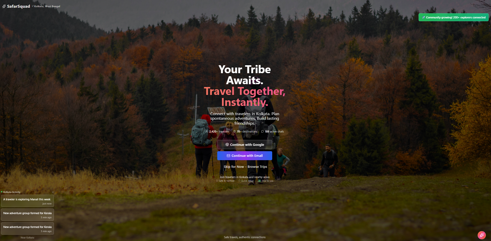
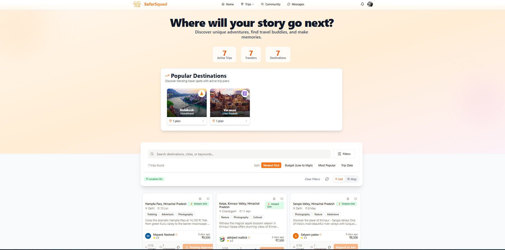
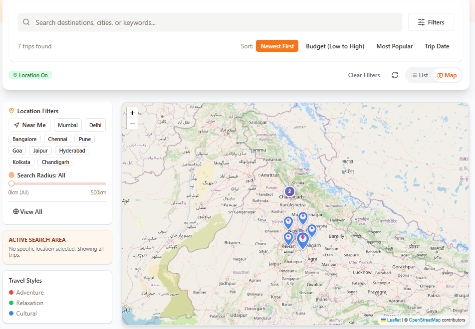
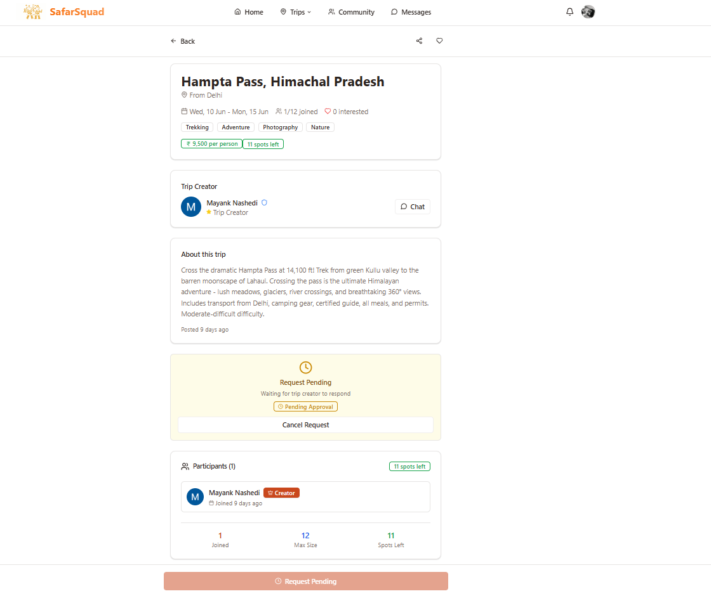
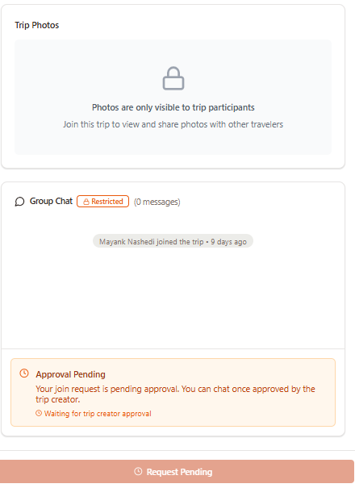
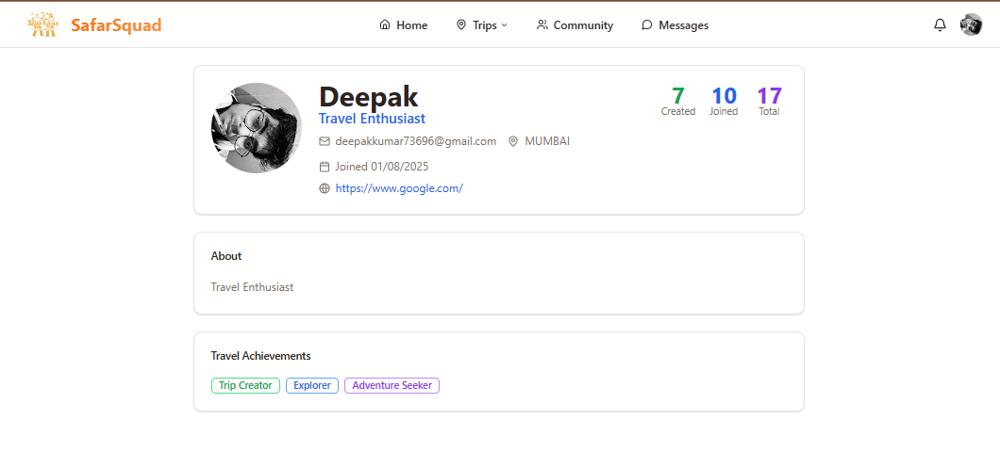
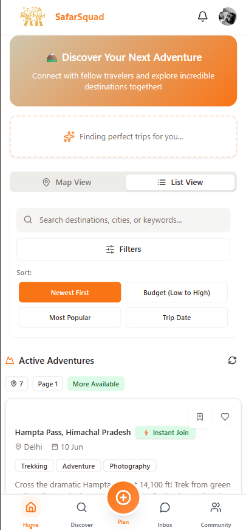

# SafarSquad 🧭

> **Find your perfect travel squad. Plan group trips across India.**

SafarSquad is a full-stack social travel app that connects like-minded travellers, enables real-time group coordination, and rewards community growth through a referral system.

🌐 **Live App:** [safarsquad.vercel.app](<[text](https://www.safarsquad.in/)>)


---

## Screenshots

### 🏠 Landing Page



### 🗺️ Trip Discovery — List View



### 🗺️ Trip Discovery — Map View



### 📋 Trip Details



### 💬 Group Chat



### 👤 Profile Page



### 📱 Mobile View



---

## Features

| Feature                  | Description                                                                       |
| ------------------------ | --------------------------------------------------------------------------------- |
| 🔍 **Trip Discovery**    | Browse and filter trips by destination, dates, budget, travel style, and distance |
| ➕ **Trip Creation**     | Create trips with referral codes, group size limits, and budget info              |
| 📩 **Join Requests**     | Send, approve, or reject join requests with optional messages                     |
| 💬 **Real-time Chat**    | Group chat per trip + private DMs between travellers                              |
| 🗺️ **Interactive Map**   | Leaflet map with clustered markers, trip popups, and radius search                |
| 🏘️ **Communities**       | Join travel communities with member management                                    |
| 🔔 **Notifications**     | Real-time push notifications via Supabase channels                                |
| 🎁 **Rewards**           | Referral-based coupon system for trip creators with 3+ confirmed attendees        |
| 📸 **Photo Gallery**     | Upload and view trip photos (participants only)                                   |
| ⭐ **Post-trip Reviews** | Leave star ratings and photos after a trip ends                                   |
| 📍 **Geolocation**       | Timezone-based location detection with coordinate fallback                        |
| 🔐 **Auth**              | Google OAuth + email/password with consent flow                                   |
| 📱 **PWA**               | Installable as a native-like app on Android and iOS                               |

---

## Tech Stack

| Layer      | Technology                                        |
| ---------- | ------------------------------------------------- |
| Frontend   | React 18 + TypeScript + Vite                      |
| Styling    | Tailwind CSS + Radix UI + shadcn/ui               |
| Backend    | Supabase (PostgreSQL + Realtime + Auth + Storage) |
| State      | React Query + React Context                       |
| Maps       | Leaflet + React Leaflet + MarkerCluster           |
| Animation  | Framer Motion                                     |
| Testing    | Vitest + React Testing Library                    |
| Deployment | Vercel                                            |

---

## Getting Started

### Prerequisites

- Node.js 18+
- A [Supabase](https://supabase.com) project

### Installation

```bash
git clone https://github.com/dgautam/safarsquad.git
cd safarsquad
npm install
```

### Environment Variables

Create a `.env` file in the root:

```env
VITE_SUPABASE_URL=your_supabase_project_url
VITE_SUPABASE_ANON_KEY=your_supabase_anon_key
```

### Running Locally

```bash
npm run dev
```

### Running Tests

```bash
npm test                 # run all 75 tests once
npm run test:watch       # watch mode
npm run test:coverage    # with coverage report
```

### Building for Production

```bash
npm run build
npm run preview
```

---

## Project Structure

```
src/
├── components/
│   ├── auth/           # Auth forms (SignUpForm) and AuthGuard
│   ├── discover/       # TripMap, MapFilters, PopularDestinations, EnhancedMapPopup
│   ├── home/           # TripFeed, EnhancedTripCard, FilterBar, CommunityHighlights
│   ├── landing/        # LandingPage with PWA install prompt
│   ├── layout/         # Footer
│   ├── navigation/     # AppNavigation with unread badge
│   ├── notifications/  # NotificationPanel
│   ├── profile/        # EditProfileModal, ProfileHoverCard, ProfileCompletionFlow
│   ├── rewards/        # CouponsList
│   ├── trip/           # TripChat, PrivateChat, PhotoGallery, JoinRequestsList,
│   │                   # ParticipantsList, PostTripModal, PostTripReviewModal, etc.
│   └── ui/             # shadcn/ui base components (50+ components)
├── contexts/           # TripCacheContext (in-memory trip caching)
├── hooks/              # 18 custom hooks
│   ├── useAuth.ts
│   ├── useBookmarks.ts
│   ├── useGeolocation.ts
│   ├── useJoinRequestManagement.ts
│   ├── useMessages.ts
│   ├── useNotifications.ts
│   ├── useParticipantManagement.ts
│   ├── usePostTripNotifications.ts
│   ├── useRecommendations.ts
│   ├── useTrendingCommunities.ts
│   ├── useTripLikes.ts
│   ├── useTripStatus.ts
│   └── useUnreadMessages.ts
├── lib/                # Utilities: geocoding, imageCache, cookies, distance, notifications
├── pages/              # 14 route-level pages (all lazy-loaded)
├── tests/              # Vitest unit tests (75 tests across 8 files)
└── types/              # Shared TypeScript types (trip.ts, database.ts)
```

---

## Architecture Notes

**Code splitting** — Every page uses `React.lazy` + `Suspense`. Only the current route's JS loads; all others are deferred.

**Custom hooks** — All business logic lives in hooks under `src/hooks/`. Pages and components stay thin — they just render.

**Real-time** — Supabase Realtime subscriptions power live chat, notifications, and unread message counts. Each subscription is cleaned up on unmount.

**Trip caching** — `TripCacheContext` keeps the first page of trips in memory for 2 minutes, so navigating back to the feed is instant.

**Image preloading** — Destination images for `PopularDestinations` are pre-fetched in the background without blocking the initial render.

**Error boundary** — A global `ErrorBoundary` wraps all routes: shows a stack trace in dev, a friendly fallback in production.

**TypeScript strict mode** — `tsconfig.json` has `strict: true`. All 0 type errors at build time.

---

## Test Coverage

```
Test Files  8 passed
Tests       75 passed

src/tests/useAuth.test.ts             9 tests
src/tests/useBookmarks.test.ts       10 tests
src/tests/useNotifications.test.ts    9 tests
src/tests/useTripLikes.test.ts        9 tests
src/tests/useTripStatus.test.ts       8 tests
src/tests/useUnreadMessages.test.ts   8 tests
src/tests/SavedTripsPage.test.tsx    10 tests
src/tests/MyTripsPage.test.tsx       12 tests
```

---

## Deployment

Deployed on [Vercel](https://vercel.com). Push to `main` triggers an automatic deploy.

`vercel.json` handles SPA routing — all paths fall back to `index.html`.

### Environment Variables (Vercel)

Set these in your Vercel project settings:

```
VITE_SUPABASE_URL
VITE_SUPABASE_ANON_KEY
```

### Supabase Setup

1. Enable **Google OAuth** in Authentication → Providers
2. Set **Site URL** to your production domain
3. Add your domain to **Redirect URLs**
4. Enable **Row Level Security** on all tables
5. Run the database migrations from `supabase/migrations/`

---

## Contributing

1. Fork the repo
2. Create a feature branch: `git checkout -b feature/my-feature`
3. Commit your changes: `git commit -m 'feat: add my feature'`
4. Push and open a PR

Please make sure `npm run lint`, `npm run typecheck`, and `npm test` all pass before opening a PR.

---

## License

MIT © [Deepak Gautam](<[text](https://github.com/Deepak-gautam1)>)
